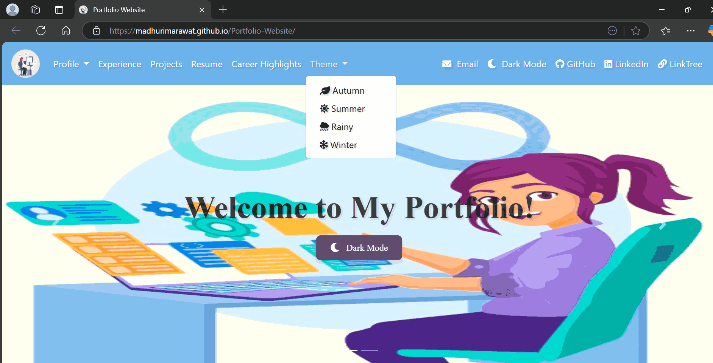
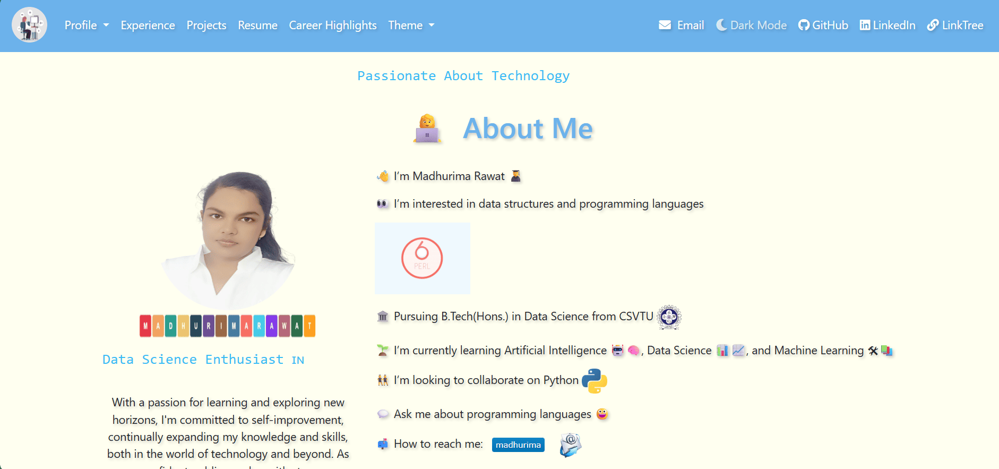
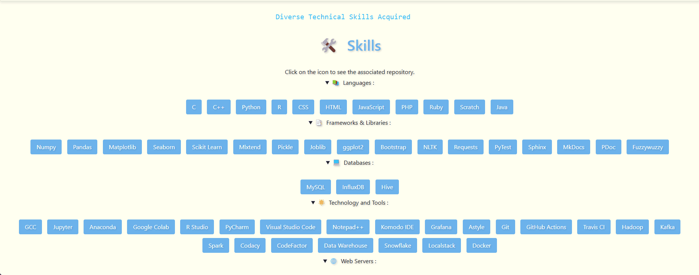

# Portfolio-Website
This portfolio showcases my work with creative emoji elements, a harmonious blend of professional colors, and a dedicated section for career highlights, presenting my technical skills.

<h2>Website Design</h2>

<a href = "https://madhurimarawat.github.io/Portfolio-Website/"></a>

<a href = "https://madhurimarawat.github.io/Portfolio-Website/"></a>

<a href = "https://madhurimarawat.github.io/Portfolio-Website/"></a>

<a href = "https://madhurimarawat.github.io/Portfolio-Website/"></a>

<a href = "https://madhurimarawat.github.io/Portfolio-Website/"></a>

<p align='center'>
🅳🅰🆁🅺 🅼🅾🅳🅴 🌙🖤 </p>

<a href = "https://madhurimarawat.github.io/Portfolio-Website/"></a>

<a href = "https://madhurimarawat.github.io/Portfolio-Website/"></a>

<a href = "https://madhurimarawat.github.io/Portfolio-Website/"></a>

<a href = "https://madhurimarawat.github.io/Portfolio-Website/"></a>

<p align='center'>
🅳🅰🆁🅺 🅼🅾🅳🅴 🌙🖤 </p>

<a href = "https://madhurimarawat.github.io/Portfolio-Website/"></a>

## Technology Used 💻

### 🛠 &nbsp;Languages and Tools :
<p>
&nbsp;&nbsp;
&nbsp;&nbsp;
&nbsp;&nbsp;&nbsp;
  &nbsp;
</p>

## Description

- This portfolio showcases a creative blend of emojis to enhance visual appeal and expressiveness.
- The design features a harmonious blend of professional colors for a polished, attractive look.
- A dedicated section highlights career achievements, making it easy to see professional milestones.
- The website is user-friendly, with an intuitive interface that is simple to navigate.
- Responsive design ensures the portfolio looks great and functions well on all devices and screen sizes.
- Added a new dropdown for dynamically changing website colors with options for Autumn, Summer, Rainy, and Winter. Upon selection, the website color changes instantly. Refreshing the website restores it to its default color scheme.
- Added a dynamic wheel animation for the social links section, where each link rotates into the center sequentially. The animation loops continuously, reversing direction after every three links. The central icon and title update with each link. Additionally, I’ve placed the social links logo on the main page and corresponding Font Awesome icons on the career highlights page.

## Directory Structure

```bash
📁 Portfolio-Website/
├── index.html                 # 🏠 Main landing page of the portfolio website
├── career-highlights.html     # 🏆 Page dedicated to career highlights and achievements
│
├── 📁 css/                    # 💅 Stylesheets
│   ├── index.css              # 🎨 Stylesheet for index.html
│   └── career-highlights.css  # 🏅 Stylesheet for career-highlights.html
│
├── 📁 js/                     # 📜 JavaScript files
│   ├── index.js               # 🎛️ Script for dynamic color changes and navbar adjustments
│   ├── career-highlights.js   # 👁️‍🗨️ Script for controlling color modes on highlights page
│   └── section-add.js         # 🧩 Script to dynamically load modular sections into index.html
│
├── 📁 images/                 # 🖼️ All images used in the website (logos, project thumbnails, etc.)
│
├── 📁 components/             # 🧱 Reusable components (like header.html, footer.html, slider-carousel.html)
│   ├── header.html            # 🔝 Navigation bar and header section
│   ├── footer.html            # 🔻 Footer section with social/contact info
│   └── slider-carousel.html   # 🎞️ Animated slider carousel for landing section
│
├── 📁 sections/               # 📦 All content sections loaded dynamically (About, Projects, etc.)
│   ├── about-me.html          # 👩‍💻 About Me section
│   ├── education.html         # 🎓 Academic background and degrees
│   ├── skills.html            # 🛠️ Technical and soft skills list
│   ├── certifications.html    # 📑 Certifications and credentials
│   ├── experience.html        # 💼 Work experience and internships
│   ├── projects.html          # 🧪 Project showcases with descriptions
│   ├── social-links.html      # 🎡 Section with animated social media wheel
│   ├── blogs-links.html       # ✍️ Blog post links or guest articles
│   ├── hobbies-and-interests.html # 🎨 Hobbies, interests, and creative pursuits
│   └── thank-you.html         # 🙏 Closing message or thank-you note
│
├── LICENSE                    # 📜 MIT License
├── README.md                  # 📘 Documentation file for repository overview, usage, and setup
```

### Files and Folders

- **index.html**: Main landing page of the portfolio website.
- **career-highlights.html**: Page dedicated to career highlights and achievements.
- **css/index.css**: Stylesheet for index.html.
- **css/career-highlights.css**: Stylesheet for career-highlights.html.
- **js/index.js**: Script to dynamically change the primary color of the website.
- **js/career-highlights.js**: Script to manage the visibility of the color switcher dropdown for the career highlights page.
- **images/**: Folder containing all images used in the website.
- **LICENSE**: MIT License file.
- **README.md**: Documentation file for the repository.

---

## Mode of Execution Used   </a> &nbsp;
<h2>Notepad++</h2>
<ul>
<li>To begin, visit the official website &nbsp; <a href="https://notepad-plus-plus.org/downloads/"> </a>   <br><br></li>
<li>Download according to the platform being used like Linux, MacOs or Windows.<br><br>
<li> Follow the setup wizard.<br><br></li>
<li> After setup, we can write code in HTML and also in other languages.<br><br></li>
<li>To see the output of HTML code open document in any browser.<br></li>
</ul>

## Hosting With Netlify

1. Visit the official website of Netlify : <a href="https://www.netlify.com/"></a>
<br><br>
2. Now make an account with GitHub.<br><br>
3. Now add all the code in Github repository.<br><br>
4. Go to netlify and there is an option for new deployment.<br><br>
5. Link with your Github repository name and make sure you have the index.html file for homepage. If you name your file as index it will directly access it else you have to specify the path.<br><br>
6. We can also do manual deployment of our website by uploading in netlify manual uploads.<br><br>
7. If everything went well our website will be deployed on web and you can share the link and access the app from all browsers.<br><br>
8. Now netlify only supports static website. It does not have a server and it does not support websites with server requirement.<br><br>
9. We can upload HTML, CSS and JS files in netlify.

## Hosting With GitHub Pages

1. Visit the official website of GitHub Pages: <a href="https://pages.github.com/"></a>
<br><br>
2. Make sure you have a GitHub account. If not, create one at [GitHub](https://github.com/).<br><br>
3. Create a new repository on GitHub and upload your project files (index.html, CSS, JS, etc.).<br><br>
4. Go to the repository settings by clicking on the "Settings" tab.<br><br>
5. Scroll down to the "Pages" section in the settings.<br><br>
6. Under "Source," select the branch you want to use for GitHub Pages (usually "main" or "master").<br><br>
7. If your index.html file is in the root directory of the repository, select the root as the source folder. Otherwise, select the appropriate folder where your index.html is located.<br><br>
8. Click "Save" to publish your site.<br><br>
9. GitHub Pages will provide a link to your live site. You can share this link and access your site from any browser.<br><br>
10. GitHub Pages also supports Jekyll, a static site generator, if you want to use it for more advanced site features.<br>

By following these steps, you can host your static website using GitHub Pages and Netlify. Both platforms provide easy-to-use interfaces and are great for deploying static websites.

---

## Website Link

<p>I have hosted this Website using <a href="https://madhurima-rawat-portfolio.netlify.app/">Netlify</a>  and  <a href = "https://madhurimarawat.github.io/Portfolio-Website/">Github Pages</a>. Click on the Link to have a look at my Website.</p>

---
## Additional Resources 

- For more Frontend Development codes, visit my repository: [Website-Frontend-Development](https://github.com/madhurimarawat/Website-Frontend-Developement).

- The [NameBlock-Designer](https://github.com/madhurimarawat/NameBlock-Designer) project contains the tool I used to create my name in blocks and make it transparent using [Remove.bg](https://www.remove.bg/). This tool generates a transparent PNG image from the given text, where the letters are initially white. If you want the letters to be transparent as well, you can use any background removal tool like Remove.bg for further customization. You can explore and use the NameBlock-Designer tool here: [NameBlock-Designer Live](https://madhurimarawat.github.io/NameBlock-Designer/).

---

## Thanks for Visiting 😄

- Drop a 🌟 if you find this repository useful.<br><br>
- If you have any doubts or suggestions, feel free to reach me.<br><br>
📫 How to reach me:  &nbsp; [](https://www.linkedin.com/in/madhurima-rawat/) &nbsp; &nbsp;
<a href ="mailto:rawatmadhurima@gmail.com"> </a><br><br>
- **Contribute and Discuss:** Feel free to open <a href= "https://github.com/madhurimarawat/Portfolio-Website/issues">issues 🐛</a>, submit <a href = "https://github.com/madhurimarawat/Portfolio-Website/pulls">pull requests 🛠️</a>, or start <a href = "https://github.com/madhurimarawat/Portfolio-Website/discussions">discussions 💬</a> to help improve this repository!
